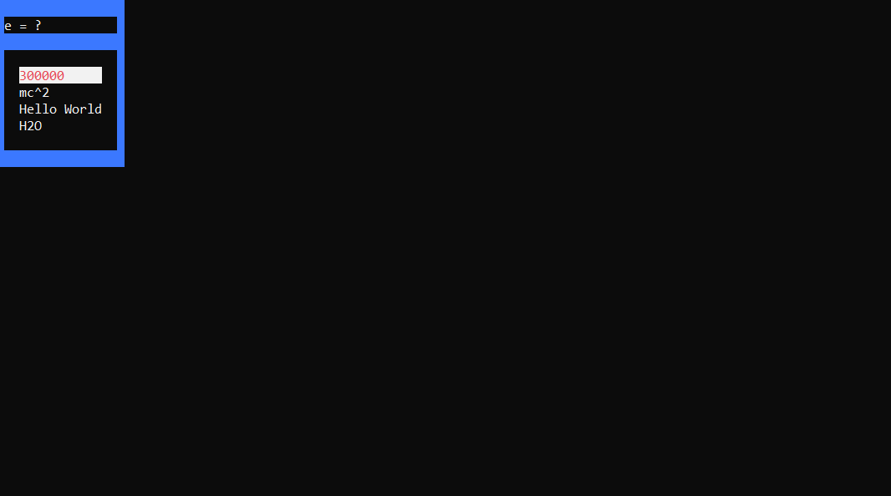

# MyStatV3.0
Creator: <B>Me(MSShift)</b>  

New console based testing system insired by Mystat, link below:  
https://mystat.itstep.org

For this to work on different devices you need to change:    
<i> const  fs::path Studentpath </i> to path where this repository is downloaded now (created in questions.h)    
<i> const fs::path Testspath </i> to path where this repository is downloaded now (created in questions.h)

This is preview of test:  

This is preview of creating a test:

<b><i>Have fun!</b></i>